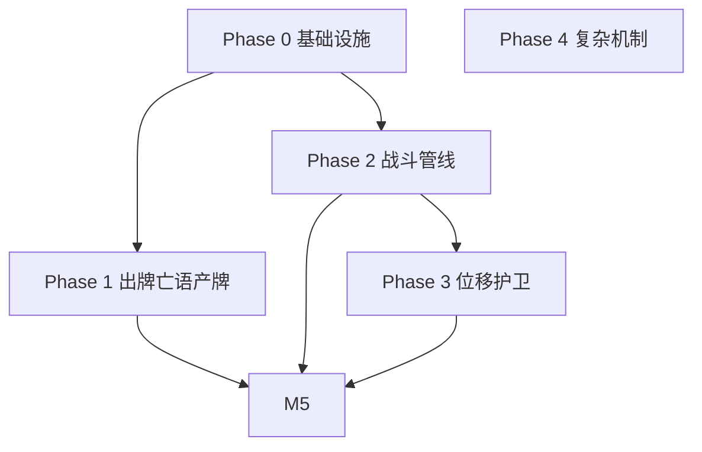

# 邪恶冥刻 · 第一章印记实现计划

> 文档版本：与代码库 `MCZJUScription` 当前结构对齐（`SigilId` / `SigilRegistry` / `CombatResolver` / `BreedingTracker`）。  
> 实现进度见 §2 状态列；代码以 `SigilRegistry` / `CombatModifiers` / `OnPlayEffects` 为准。

---

## 1. 目标范围

实现《邪恶冥刻》第一章中出现的印记（能力）机制，并与现有对局流程（抽牌 / 出牌 / 敲钟战斗 / 回合末结算）兼容。

本文档覆盖用户提供的 **35 项** 第一章印记说明，并标注：

- 当前代码中的实现状态  
- 建议的 `SigilId` 命名  
- 触发时机（`SigilTrigger`）  
- 分阶段实施顺序与依赖  

---

## 2. 当前代码现状

### 2.1 已实现（Registry 或硬编码）

| 中文名 | SigilId | 实现方式 | 备注 |
|--------|---------|----------|------|
| 尖刺铠甲 | `SPIKY_ARMOR` | `SigilRegistry` · `ON_ATTACKED` | 被攻击时反击 1 点伤害 |
| 骨皇 | `BONE_ROYALTY` | `SigilRegistry` · `ON_DEATH` | 死亡获得 4 骨（非 +3） |
| 繁殖 | `BREEDING` | `BreedingTracker` · `ON_TURN_END` | 战斗开始时已在场，回合末存活则入手同卡 |
| 幼雏 | `FLEDGLING` | `FledglingGrowth` · `ON_TURN_END` | 狼崽→狼；无原生表则「长老」+1/+1 |
| 空袭 | `AIR_STRIKE` | `CombatResolver` + `CombatModifiers` | 蜜蜂卡已绑定 |
| 水袭 | `WATER_STRIKE` | `CombatModifiers.isSubmerged` | 敌方回合潜水直击 |
| 死神之触 | `TOUCH_OF_DEATH` | `CombatModifiers.canDeathtouchKill` | 磐石免疫 |
| 臭臭 | `STINKY` | `CombatModifiers.effectiveAttack` | 对阵 -1 力 |
| 优质祭品 | `QUALITY_SACRIFICE` | `sacrifice()` | 献祭计 3 点腐肉 |
| 生生不息 | `ETERNAL_LIFE` | `sacrifice()` | **献祭后留场（已按 §7 定稿）** |

### 2.2 已有枚举、未接 Handler

| SigilId | 中文名（SigilNames） |
|---------|----------------------|
| `RABBIT_HOLE` | 兔穴 |
| `HIGH_JUMP` | 高跳 |
| `LEADER_POWER` | 领袖力量 |
| `RUSH_LEFT` | 左冲 |
| `RUSH_RIGHT` | 右冲 |
| `ICY_ENTOMB` | 冰封（占位，狼崽已改幼雏） |

### 2.3 已有触发钩子、部分印记未用

- `playCardToSlot` 末尾：`SigilTrigger.ON_PLAY`
- `sacrifice`：`ON_SACRIFICE` + `ETERNAL_LIFE` 特殊分支
- `killCreature`：`ON_DEATH`
- `TurnController.ringBell` → `BreedingTracker.markCombatStart` → 回合末 `resolveAfterCombat`

### 2.4 卡牌与数据缺口

- 蜜蜂 `BEE` 未挂「空袭」；堤坝 `DAM` 为 0/5（兔穴描述常为 0/2）。
- 无蚂蚁、兽皮、蝌蚪等扩展 `CardId`（部分印记依赖）。
- 无道具包系统（道具商暂缓）。

---

## 3. 第一章印记对照表（35 项）

| # | 中文名 | 原版 Ability 参考 | 建议 SigilId | 建议触发 | 状态 | 分期 |
|---|--------|-------------------|--------------|----------|------|------|
| 1 | 兔穴 | drawrabbits | `RABBIT_HOLE` | `ON_PLAY` | **已实现** | P1 |
| 2 | 内心之蜂 | beesonhit | `BEE_STING` | `ON_ATTACKED` | **已实现** | P1 |
| 3 | 冲刺能手 | strafe | `RUSH_LEFT` / `RUSH_RIGHT` | `ON_TURN_END` | **已实现**（`BoardShift`） | P3 |
| 4 | 死神之触 | deathtouch | `TOUCH_OF_DEATH` | 战斗命中 | 硬编码 | P2 |
| 5 | 幼雏 | evolve | `FLEDGLING` | `ON_TURN_END` | **已实现** | — |
| 6 | 筑坝师 | createdams | `DAM_BUILDER` | `ON_PLAY` | **已实现**（`DAM_TOKEN` 0/2） | P1 |
| 7 | 囤积狂 | tutor | `TUTOR` | `ON_PLAY` | **已实现**（顶 3 选 1 菜单） | P4 |
| 8 | 钻地龙 | whackamole | `WHACK_A_MOLE` | `PRE_COMBAT` | **已实现** | P3 |
| 9 | 丰产之巢 | drawcopy | `COPY_ON_PLAY` | `ON_PLAY` | **已实现** | P1 |
| 10 | 断尾求生 | tailonhit | `TAIL_ON_HIT` | `PRE_COMBAT` | **已实现** | P3 |
| 11 | 食尸鬼 | corpseeater | `CORPSE_EATER` | 战斗阵亡 | **已实现** | P4 |
| 12 | 骨皇 | quadruplebones | `BONE_ROYALTY` | `ON_DEATH` | **已实现** | — |
| 13 | 水袭 | submerge | `WATER_STRIKE` | 敌方回合战斗 | 部分硬编码 | P2 |
| 14 | 不死之虫 | drawcopyondeath | `COPY_ON_DEATH` | `ON_DEATH` | **已实现** | P1 |
| 15 | 尖刺铠甲 | sharp | `SPIKY_ARMOR` | `ON_ATTACKED` | **已实现** | — |
| 16 | 蛮力冲撞 | strafepush | `RUSH_PUSH` | 位移附带 | **已实现**（`BoardShift` 推挤） | P3 |
| 17 | 蚁后 | drawant | `ANT_QUEEN` | `ON_PLAY` | **已实现**（`ANT` 卡） | P1 |
| 18 | 守护者 | guarddog | `GUARD_DOG` | `PRE_COMBAT` | **已实现** | P3 |
| 19 | 空袭 | flying | `AIR_STRIKE` | 战斗目标 | 硬编码 | P2 |
| 20 | 生生不息 | sacrificial | `ETERNAL_LIFE` | `ON_SACRIFICE` | **已实现**（献祭留场） | P2 |
| 21 | 厌恶情绪 | preventattack | `PREVENT_ATTACK` | 战前 | 未实现 | P2 |
| 22 | 优质祭品 | tripleblood | `QUALITY_SACRIFICE` | 献祭 | 硬编码 | P2 |
| 23 | 高跳 | reach | `HIGH_JUMP` | 战前拦截 | 枚举有 | P2 |
| 24 | 兵分两路 | splitstrike | `SPLIT_STRIKE` | `ON_COMBAT_ATTACK` | 未实现 | P2 |
| 25 | 兵分三路 | tristrike | `TRI_STRIKE` | `ON_COMBAT_ATTACK` | 未实现 | P2 |
| 26 | 冰封禁锢 | icecube | `ICY_ENTOMB` | `ON_DEATH` | **已实现**（`IcyEntombRelease`） | P1 |
| 27 | 道具商 | randomconsumable | `ITEM_VENDOR` | `ON_PLAY` | 无道具系统 | 暂缓 |
| 28 | 铁兽夹 | steeltrap | `STEEL_TRAP` | `ON_DEATH` | **已实现** | P1 |
| 29 | 无形之物 | randomability | `RANDOM_SIGIL` | `ON_PLAY` | **已实现**（出牌时随机附加印记） | P4 |
| 30 | 潮汐锁定 | squirrelorbit | `ORBIT` | `ON_TURN_START` | 未实现 | P4 |
| 31 | 全向打击 | allstrike | `ALL_STRIKE` | `ON_COMBAT_ATTACK` | 未实现 | P2 |
| 32 | 领袖力量 | buffneighbours | `LEADER_POWER` | `AURA` | 枚举有 | P2 |
| 33 | 鸣钟人 | createbells | `BELL_RINGER` | `ON_PLAY` | **已实现** | P1 |
| 34 | 臭臭 | debuffenemy | `STINKY` | `AURA` / 对阵 | 部分硬编码 | P2 |
| 35 | 磐石之身 | madeofstone | `ROCK_BODY` | 被动免疫 | 枚举有 | P2 |

**分期说明**

- **P1**：出牌 / 死亡 / 被攻击 / 回合末，逻辑相对独立  
- **P2**：战斗管线（目标选择、多段攻击、免疫、空袭/水袭/高跳）  
- **P3**：场面位移（左冲、右冲、断尾、守护者、蛮力冲撞、钻地龙）  
- **P4**：复杂系统（食尸鬼、囤积狂 UI、潮汐锁定、无形之物、道具商）  

---

## 4. Phase 0 — 基础设施（必须先做）

### 4.1 扩展 `SigilTrigger`

| 触发器 | 用途示例 |
|--------|----------|
| `ON_DRAW` | 无形之物、抽到时替换印记 |
| `ON_TURN_START` | 潮汐锁定 |
| `PRE_COMBAT` / `ON_TARGETED` | 钻地龙、断尾、厌恶情绪 |
| `ON_COMBAT_ATTACK` | 兵分两路、兵分三路、全向打击（攻击者视角） |

保留现有：`ON_PLAY`、`ON_ATTACKED`、`ON_DEATH`、`ON_SACRIFICE`、`ON_TURN_END`、`AURA`。

### 4.2 统一战斗管线

将 `CombatResolver` 中硬编码的空袭 / 水袭 / 臭臭 / 死触 迁入可测试的模块：

- `AttackPattern`：单列对战 / 直击天平 / 多列 / 全列  
- `CombatTargeting`：高跳拦截空袭、厌恶情绪跳过目标、水袭潜水  

### 4.3 场面位移子系统

- 4 列槽位（0–3）左/右相邻定义  
- `BoardShift.move(creature, delta)` + 推挤（蛮力冲撞）  
- 与 `PreviewAdvanceSequence`、`BoardVfx` 动画一致  

### 4.4 衍生卡 / 填手 API

```text
grantCardToHand(side, cardId)          // 已有
spawnTokenOnSlot(side, slotIndex, cardId)  // 待建：兔穴邻格、筑坝、鸣钟
spawnTokenOnAdjacentEmpty(sourceSlot, cardId)
```

建议配置表（实现时）：

```text
FledglingGrowth.NATIVE_GROWTH   # 幼雏原生成长
IcyEntomb.RELEASE_MAP           # 冰封解禁造物
OnPlayTokens.*                  # 各 ON_PLAY 印记产出
```

### 4.5 印记元数据（可选类 `SigilDefinition`）

- 显示名（对接 `SigilNames`）  
- 默认触发器  
- 是否方向性（左冲/右冲）  
- 是否可被无形之物随机替换  

### 4.6 牌组检索（囤积狂专用，可二期）

- 简化版：从主牌组顶 3 张选 1 张入手  
- 完整版：Chest GUI 搜索牌组  

---

## 5. Phase 1 — 出牌 / 亡语 / 受击（详细）

### 5.1 兔穴 `RABBIT_HOLE`

- **效果**：打出时，手牌增加一张兔子（0/1，免费）。  
- **实现**：`ON_PLAY` → `grantCardToHandSilent(RABBIT)`。  
- **依赖**：无。

### 5.2 丰产之巢 `COPY_ON_PLAY`

- **效果**：打出时，手牌增加一张相同的牌。  
- **实现**：`ON_PLAY` → `grantCardToHandSilent(source.cardId())`。  

### 5.3 蚁后 `ANT_QUEEN`

- **效果**：打出时，手牌增加一张蚂蚁。  
- **实现**：新增 `CardId.ANT`（需定义攻防与费用）；`ON_PLAY` 发牌。  

### 5.4 筑坝师 `DAM_BUILDER`

- **效果**：打出时，**附近空位**出现堤坝（0/2 或沿用 `DAM` 卡并调数值）。  
- **实现**：`ON_PLAY` 遍历邻格（建议：**仅左、右** 两格，与 4 列战场一致）；空则 `spawnToken`。  
- **待确认**：邻格定义（见 §7）。

### 5.5 鸣钟人 `BELL_RINGER`

- **效果**：打出时，邻格空位出现铃铛（0/1）。  
- **实现**：同筑坝师，token 为 `BELL_TOKEN`。  

### 5.6 不死之虫 `COPY_ON_DEATH`

- **效果**：阵亡时，手牌出现一张同样的牌。  
- **实现**：`ON_DEATH` Handler（注意与 `killCreature` 槽位替换逻辑顺序）。  

### 5.7 内心之蜂 `BEE_STING`

- **效果**：**带有该印记的卡牌被攻击时**，手牌出现蜜蜂（1/1，**带空袭**）。  
- **实现**：`ON_ATTACKED`，source=被攻击者；给 `BEE` 卡定义添加 `AIR_STRIKE`。  
- **区别**：不是「尖刺」反击，是产牌。

### 5.8 冰封禁锢 `ICY_ENTOMB`

- **效果**：阵亡时，冰封内的造物取代其位置（狼崽→巨狼等）。  
- **实现**：`ON_DEATH` + `ICY_ENTOMB_RELEASE` 映射表；`replaceWith`，且 `killCreature` 勿清空已替换槽位（现有注释已考虑）。  
- **与幼雏**：狼崽已改为幼雏成长→**狼**，冰封应使用独立映射（如狼崽→巨狼若仍需要则走冰封表，不与幼雏混用）。

### 5.9 铁兽夹 `STEEL_TRAP`

- **效果**：阵亡时，**对面**同列造物阵亡；手牌出现兽皮。  
- **实现**：`ON_DEATH` 查对面 slot；`killCreature`；`grantCardToHand(PELT)`。  

### 5.10 暂缓

| 印记 | 原因 |
|------|------|
| 道具商 | 无道具包 |
| 无形之物 | 需抽牌时改写印记与 UI |

---

## 6. Phase 2 — 战斗（详细）

### 6.1 空袭 `AIR_STRIKE`

- **效果**：可无视对面造物，直击对方持牌人（天平）。  
- **实现**：迁入 Registry；`evaluateSlot` 读攻击者 sigil。  

### 6.2 水袭 `WATER_STRIKE`

- **效果**：**对方回合**潜水；潜水时不与对位造物交战，持牌人遭直击。  
- **实现**：防守方且带水袭且为敌方回合 → `submerged`；现有逻辑增强动画与 Registry。  

### 6.3 高跳 `HIGH_JUMP`

- **效果**：拦截带有空袭的对方造物（使其必须与普通对战一样对位）。  
- **实现**：攻击分配阶段，若对面列有 `HIGH_JUMP` 且攻击者有 `AIR_STRIKE`，强制走 `CreatureStrike`。  

### 6.4 死神之触 `TOUCH_OF_DEATH`

- **效果**：造成伤害则击杀。  
- **实现**：迁入 Registry；**磐石**免疫（见下）。  

### 6.5 磐石之身 `ROCK_BODY`

- **效果**：免疫**对手**的死神之触与臭臭。  
- **实现**：`computeAttack` / 击杀判定前检查攻击者与防御方 sigil；己方臭臭是否生效待确认（§7）。  

### 6.6 臭臭 `STINKY`

- **效果**：与他对阵的造物 -1 力量。  
- **实现**：从硬编码迁入 Aura；明确「对阵」= 同列对战。  

### 6.7 厌恶情绪 `PREVENT_ATTACK`

- **效果**：其他造物攻击它时会放弃攻击。  
- **实现**：`evaluateSlot` 若防御者有该 sigil，返回 null strike（或跳过动画）。  

### 6.8 生生不息 `ETERNAL_LIFE`

- **效果**：被献祭后**不死亡**（仍献祭计费/触发献祭效果）。  
- **实现**：`sacrifice` 中不 `removeCreature`；或标记「已献祭」后清场。  
- **与现逻辑**：当前为 `grantCardToHand`，需产品确认（§7）。  

### 6.9 兵分两路 `SPLIT_STRIKE`

- **效果**：攻击正前方**左、右**两格（各一次，若存在造物）。  
- **实现**：扩展 `resolveSlotAnimated` 或单槽多 strike 序列。  

### 6.10 兵分三路 `TRI_STRIKE`

- **效果**：攻击左、中、右三格。  

### 6.11 全向打击 `ALL_STRIKE`

- **效果**：攻击对面**每一个**占格；若全空则直击。  

### 6.12 领袖力量 `LEADER_POWER`

- **效果**：相邻友方 +1 力量。  
- **实现**：`computeAttack` / 回合初 Aura 刷新；左/右邻格判定。  

---

## 7. Phase 3 — 位移与护卫

### 7.1 左冲 / 右冲 `RUSH_LEFT` / `RUSH_RIGHT`

- **效果**：持牌人回合结束时，向印记标注方向移动 1 格。  
- **实现**：`ON_TURN_END`（己方回合末，在 `endTurn` 或出牌阶段末区分）；卡面需存方向。  

### 7.2 蛮力冲撞 `RUSH_PUSH`

- **效果**：移动时推动同方向上一格造物。  
- **实现**：位移系统 + 连锁推挤（边界顶死）。  

### 7.3 守护者 `GUARD_DOG`

- **效果**：若敌方面某列**对面为空**，则移入该列（护卫空位）。  
- **实现**：战前 `PRE_COMBAT` 扫描；仅己方空列可站入。  

### 7.4 钻地龙 `WHACK_A_MOLE`

- **效果**：当某空位将受攻击时，移入该位挡刀。  
- **实现**：直击判定前预测目标列；手牌/场面需能识别「将受攻击」（复杂）。  

### 7.5 断尾求生 `TAIL_ON_HIT`

- **效果**：将受攻击时，原格留尾巴，自身向右移。  
- **实现**：`PRE_COMBAT`；生成 `TAIL` token；右移一格。  

---

## 8. Phase 4 — 复杂 / 二期

### 8.1 食尸鬼 `CORPSE_EATER`

- **效果**：己方造物**在战斗中**阵亡时，手牌中食尸鬼**自动补位**到空槽。  
- **依赖**：手牌↔场面桥接、战斗事件广播、空槽选择规则。  

### 8.2 囤积狂 `TUTOR`

- **效果**：打出时，从牌组任选一张入手。  
- **依赖**：牌组检索 GUI 或简化抽选。  

### 8.3 潮汐锁定 `ORBIT`

- **效果**：己方回合初，将小造物（如松鼠）拉入卫星轨道。  
- **依赖**：回合开始钩子、附属实体或特殊槽位表现。  

### 8.4 无形之物 `RANDOM_SIGIL`

- **效果**：抽到时，印记随机替换为另一个。  
- **依赖**：`BoardCreature` / 卡牌物品运行时 sigil 列表、UI 刷新。  

### 8.5 幼雏扩展

在 `FledglingGrowth.NATIVE_GROWTH` 中扩展，例如：

| 幼体 | 成体 |
|------|------|
| 狼崽 | 狼 |
| 蝌蚪 | 牛蛙 |
| 冰原狼幼崽 | 冰原狼 |
| 渡鸦蛋 | 渡鸦 |
| … | 配置驱动 |

**附加幼雏**（非原生卡获得幼雏印记）：长老 +1/+1，名称「长老{原名}」（`BoardCreature.applyElderForm` 已实现思路）。

---

## 9. 与现有系统衔接

| 系统 | 注意点 |
|------|--------|
| `BreedingTracker` | 仅对「战斗开始时已在场」存活者触发 `ON_TURN_END`；繁殖与幼雏勿重复结算 |
| `FledglingGrowth` | 与 `ICY_ENTOMB` 死亡替换分流，避免狼崽两条线冲突 |
| `killCreature` | 槽位 `replaceWith` 后勿清槽（已有注释） |
| `grantCardToHand` vs `Silent` | 产 token 一般静默，避免刷屏 |
| AI `EnemyPlanner` | 新卡 / 位移后需更新落子逻辑 |
| 商店无限购 | 产牌印记不与「每回合仅兔子进 PLAY」冲突 |

---

## 10. 推荐里程碑

| 里程碑 | 内容 | 粗略工期 |
|--------|------|----------|
| **M0** | Phase 0 最小集：Registry 补全触发映射、`spawnToken`、配置表骨架 | 1–2 天 |
| **M1** | Phase 1 全部 P0/P1（兔穴、丰产、蚁后、筑坝、鸣钟、不死之虫、内心之蜂、冰封、铁兽夹） | 2–3 天 |
| **M2** | Phase 2 战斗管线重构 + 空袭/水袭/高跳/死触/臭臭/磐石/厌恶/领袖 | 3–4 天 |
| **M3** | Phase 2 多段攻击（分两路、三路、全向）+ 生生不息定稿 | 2 天 |
| **M4** | Phase 3 位移（左冲/右冲、守护者、断尾、蛮力、钻地龙） | 3–4 天 |
| **M5** | Phase 4 按优先级选做（食尸鬼、囤积狂、潮汐、无形之物） | 视需求 |



---

## 11. 待产品/策划确认的规则

在写代码前建议锁定以下条目，避免返工：

| # | 问题 | 选项倾向（可参考原版） |
|---|------|------------------------|
| 1 | **生生不息**：献祭后是否留在场上？ | 原版：不死亡，仍触发献祭 |
| 2 | **水袭潜水**：是否仍受领袖、臭臭等影响？ | 仅改变对战方式，直击仍发生 |
| 3 | **磐石之身**：是否免疫己方臭臭？ | 原版：仅免疫**对手**印记 |
| 4 | **筑坝/鸣钟「附近」**：左+右两格，还是含前后列？ | 建议：同排相邻格（左/右） |
| 5 | **堤坝数值**：0/2 还是沿用现 0/5？ | 建议独立 token 定义 0/2 |
| 6 | **狼崽成长线**：幼雏→狼 vs 冰封→巨狼 | 当前代码：幼雏→狼；冰封单独表 |
| 7 | **第一章交付范围**：是否允许「显示印记但未实现」？ | 测试包可分批开 sigil |

---

## 12. 文件与模块规划（实现时）

| 模块 | 职责 |
|------|------|
| `game/sigil/SigilId.java` | 枚举扩展 |
| `game/sigil/SigilRegistry.java` | Handler 注册与触发映射 |
| `game/sigil/SigilNames.java` | 中文显示 |
| `game/sigil/FledglingGrowth.java` | 幼雏 |
| `game/sigil/BreedingTracker.java` | 回合末存活结算（可改名为 `SurvivalSigilTracker`） |
| `game/sigil/IcyEntombRelease.java` | 冰封映射（新建） |
| `game/sigil/OnPlayEffects.java` | 兔穴/筑坝/鸣钟等（新建） |
| `game/combat/CombatResolver.java` | 战斗目标与多段攻击 |
| `game/combat/AttackPatterns.java` | 攻击模式（新建） |
| `game/board/BoardShift.java` | 位移（新建） |
| `game/card/CardRegistry.java` | 新卡与 sigil 绑定 |

---

## 13. 修订记录

| 日期 | 说明 |
|------|------|
| 2026-05-18 | 初稿：基于对话整理第一章 35 印记与分期计划 |

---

*实现代码时请以此文档为 checklist，完成一项在表中更新「状态」列。*
