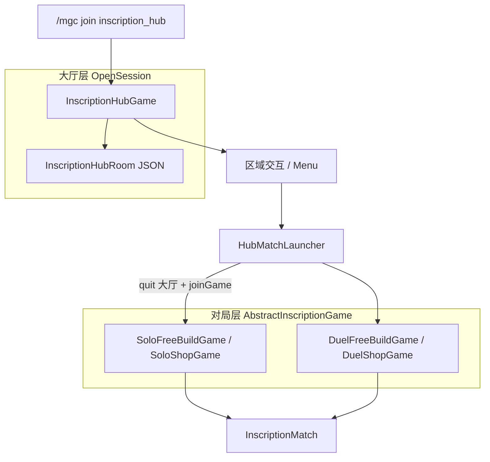

# 邪恶冥刻 · 等待大厅实现计划

> 文档版本：与 `MCZJUScription` + `MCZJUGameCore`（MGC）api-overview 对齐。  
> 用途：作为**唯一实施清单**；按 §8 分条落实，完成后在状态列打勾。  
> 相关：`api-overview.md`（MGC API）、`chapter1-sigils-plan.md`（对局内印记）

---

## 1. 目标

玩家通过 MGC 加入「邪恶冥刻」后，先进入**共享等待大厅**（非立即开局），在大厅内完成：

| 区域 | 当前目标 | 未来扩展 |
|------|----------|----------|
| 选配卡组区 | 讲台右键 → 构牌界面 | — |
| 赐福区域 | 交互点 + 占位 UI | 局外永久增益 |
| 诅咒选择区 | 交互点 + 占位 UI | 对局难度修饰 |
| 排行榜 | 前十名 GUI | 按通关难度、同难度按通关次数 |
| 单人对战区 | 「椅子」交互 → 选商店/自由构牌 → 进对局 | — |
| 双人对战区 | 椅子 + Party → 选模式 + 确认诅咒 → 进对局 | PvP 流程完成后开放 |
| 路标 | 可配置 `TextDisplay` 位置与文案 | — |

**不在本阶段**：改写对局内 `InscriptionMatch` 核心流程；MGC 未完成的 `ScoreManager` / `HistoryScoreManager`。

---

## 2. 架构原则（必读）

### 2.1 两层 Game



| 层级 | MGC 基类 | 等待策略 | 说明 |
|------|----------|----------|------|
| **大厅** | `OpenSessionGame` | `DefaultOpenSessionGameWaitStrategy` | 多人常驻；`onPlayerJoin` 传送、发大厅状态；**不**创建 `InscriptionMatch` |
| **对局** | `AbstractInscriptionGame`（现有变体） | 单人：`DefaultSinglePlayerGameWaitStrategy`；双人：`DefaultGameWaitStrategy(2,2)` 或自定义 | 从大厅 `joinGame` 后照旧 `onGameStart` → `InscriptionMatch` |

### 2.2 为何不用「一个 GameWaitStrategy 包办大厅」

- `DefaultSinglePlayerGameWaitStrategy`：**加入即 `startGame()`**，与大厅矛盾（当前 `inscription` 入口问题根源）。
- 共享大厅若用普通 `WAITING` + 自定义 `GameWaitStrategy` 且不 `startGame()`：多人挤在同一 `AbstractGame` 实例，状态混乱。
- **结论**：大厅 = `OpenSessionGame`；`GameWaitStrategy` 自定义仅用于**双人候场 / 开房前确认**（可选，见 §7.4）。

### 2.3 Listener 分流

```java
PlayerExt ext = new PlayerExt(player);
if (ext.isInGame(InscriptionHubGame.class)) { /* 大厅交互 */ return; }
if (ext.isInGame(AbstractInscriptionGame.class) && game.getState() == RUNNING) { /* 对局 */ }
```

---

## 3. MGC API 映射

| 需求 | MGC / 本项目 API |
|------|------------------|
| 注册大厅 | `GameManager.registerGame(InscriptionHubGame.class, InscriptionHubRoom.class)` |
| 房间坐标 | `JsonGameRoom` public 字段 + `/mgcop room edit inscription_hub <room>` |
| 进房传送 / Profile | `PlayerExt.switchProfile(InscriptionHubGame.GAME_ID)`；`onPlayerJoin` 内 `teleport(spawnAt)`、`resetState()` |
| 构牌菜单 | 已有 `MenuFacade.registerMenu("inscription_deck", DeckBuilderMenu.class)` |
| 确认对话框 | `AlertMenu`（双人诅咒确认等） |
| 文案 | `TextParser`（TextDisplay、物品 lore） |
| 持久化 | `InscriptionPlayerData`（`DATA_ID = "inscription"`） |
| 双人组队 | `PartyManager`；队长 `joinGame` 时整队进入（api-overview §四） |
| 启动对局 | `player.quitGame(...)` 离开大厅 → `GameManager.joinGame(player, SoloShopGame.class)` 等 |
| 排行榜 | **自研**：扩展 `InscriptionPlayerData` + 扫描/聚合；不用 `ScoreManager`（未就绪） |

---

## 4. 房间配置 `InscriptionHubRoom`

**路径**：`plugins/MCZJUGameCore/rooms/inscription_hub/<roomName>.json`  
**类**：`com.github.mczju.mczjuscription.lobby.InscriptionHubRoom extends JsonGameRoom`

### 4.1 建议字段（均为 `public`，供 JSON 序列化）

| 字段 | 类型 | 说明 |
|------|------|------|
| `spawnAt` | `Location` | 进入大厅默认落点 |
| `deckLecternAt` | `Location` | 选配卡组讲台方块中心（右键检测） |
| `blessingAt` | `Location` | 赐福区交互点（方块或压力板中心） |
| `curseSelectAt` | `Location` | 诅咒选择区交互点 |
| `leaderboardAt` | `Location` | 排行榜交互点 |
| `soloSeat0` … `soloSeatN` | `Location` | 单人座位（含 yaw/pitch）；伪数组 `soloSeat0`,`soloSeat1`… |
| `duelSeat0` … `duelSeatM` | `Location` | 双人座位 |
| `signAt0` … | `Location` | 路标 TextDisplay 位置 |
| `signText0` … | `String` | 路标文案（MiniMessage） |

**容差**：交互检测建议方块距离 ≤ 1.5（或同 block X/Y/Z）。

### 4.2 示例 JSON 片段

```json
{
  "gameId": "inscription_hub",
  "roomName": "main",
  "spawnAt": { "world": "world", "x": 0, "y": 64, "z": 0, "yaw": 0, "pitch": 0 },
  "deckLecternAt": { "world": "world", "x": 5, "y": 64, "z": 0 },
  "signAt0": { "world": "world", "x": 4, "y": 66, "z": 0 },
  "signText0": "<gold>选配卡组</gold>\n<gray>讲台右键"
}
```

---

## 5. 代码模块划分

```
com.github.mczju.mczjuscription.lobby/
├── InscriptionHubGame.java           # OpenSessionGame，GAME_ID = inscription_hub
├── InscriptionHubRoom.java           # JsonGameRoom 字段
├── HubZoneListener.java              # 讲台 / 区域 / 座位 / 排行榜点击
├── HubSignageService.java            # 按房间配置生成/销毁 TextDisplay
├── HubSeatService.java               # 占座、离座、冲突检测
├── HubSession.java                   # 内存：座位、已选模式、诅咒确认状态（UUID）
├── HubMatchLauncher.java             # quit 大厅 → joinGame(变体)
├── strategy/
│   └── InscriptionDuelWaitStrategy.java   # 可选：双人开房前等待
└── menu/
    ├── SoloModePickMenu.java         # 商店 / 自由构牌
    ├── DuelModePickMenu.java         # 模式 + 诅咒确认链
    ├── LeaderboardMenu.java          # 前十 GUI
    ├── BlessingPlaceholderMenu.java
    └── CursePlaceholderMenu.java
```

**修改现有类（清单见 §8）**：

- `InscriptionGames.java` — 注册 hub；主入口指向 hub
- `InscriptionPlayerData.java` — 排行 / 赐福 / 诅咒字段
- `AbstractInscriptionGame.recordPlayerStats` — 对局结束更新排行
- `MCZJUScriptionPlugin.onEnable` — 注册 Listener、可选菜单 ID
- `plugin.yml` — 权限 `inscription.hub`（可选）

---

## 6. 功能规格

### 6.1 选配卡组区

- **触发**：大厅内右键 `deckLecternAt` 讲台（或附近 Lectern 方块）。
- **行为**：`new DeckBuilderMenu(player).open()` 或 `MenuFacade` 等价调用。
- **权限**：`inscription.deck`（与 `/isc deck` 一致）。

### 6.2 赐福区域（占位）

- **触发**：右键 `blessingAt`。
- **行为**：`BlessingPlaceholderMenu` — 说明「即将推出」；可选写入 `InscriptionPlayerData.blessings` 空列表占位。
- **后续**：局外养成系统接入同一 Menu / 数据字段。

### 6.3 诅咒选择区（占位）

- **触发**：右键 `curseSelectAt`。
- **行为**：`CursePlaceholderMenu` — 选择诅咒写入 `InscriptionPlayerData.selectedCurse`（字符串 ID，默认 `none`）。
- **双人**：在 `DuelModePickMenu` 流程中再次展示并 `AlertMenu` 双方确认。

### 6.4 排行榜

**排序规则**：

1. `bestClearDifficulty` **降序**（数值越大 = 通关难度越高）
2. 相同则 `clearCountAtBestDifficulty` **降序**（该难度下的通关次数）
3. 取前 **10** 名

**展示**：`LeaderboardMenu`（6 行 GUI），每行玩家名 + 难度 + 次数；暂无数据时提示。

**数据来源**：遍历 `inscription` 命名空间下所有 `InscriptionPlayerData`（或 MGC `PlayerDataManager` 提供的枚举 API，若有）。

**对局结束写入**：在 `AbstractInscriptionGame.recordPlayerStats` 中根据本局难度字段更新（难度来源需在 §6.4.1 定稿）。

#### 6.4.1 待决项（实现前确认）

- [ ] **难度标量定义**：例如章节 ID、层数、诅咒组合权重；首版可用 `int chapter` 或 `String runId` 映射为 `int difficultyScore`。

### 6.5 单人对战区

1. 玩家右键 `soloSeatK` 或进入座位半径 → `HubSeatService.tryOccupy(uuid, seatId)`。
2. 传送到座位 `Location`（yaw/pitch）；可选 `ArmorStand` 骑乘模拟椅子。
3. 打开 `SoloModePickMenu`：**商店模式** → `SoloShopGame`；**自由组卡** → `SoloFreeBuildGame`。
4. `HubMatchLauncher.startSolo(player, variant)`：
   - `quitGame` 离开 hub（`PlayerQuitReason.COMMAND_QUIT` 或合适枚举）
   - `GameManager.joinGame(player, TargetClass)`（ leisure 房间由 MGC 分配）
5. 对局侧保持 `DefaultSinglePlayerGameWaitStrategy`（进房即开）。

### 6.6 双人对战区

1. 需要 **Party 2 人**（队长操作；成员需在 `duelSeat` 就位或同区域）。
2. `DuelModePickMenu`：模式（商店/构牌）→ 展示双方诅咒 → `AlertMenu` 确认。
3. `HubMatchLauncher.startDuel(party, variant)`：全队 quit hub → `joinGame` → `DuelShopGame` / `DuelFreeBuildGame`。
4. 对局：`DefaultGameWaitStrategy(this, 2, 2)`；人满 `startGame()`。
5. **注册时机**：`InscriptionGames.registerDuelVariants()` 在 PvP 就绪后于 `onEnable` 调用；大厅菜单可对未注册变体灰显。

### 6.7 路标 TextDisplay

- **生成**：`HubSignageService.spawnAll(InscriptionHubRoom)` — 在 hub `onGameInit`（仅首次）或房间加载后执行。
- **属性**：`TextDisplay`，billboard，`TextParser.parse(signTextN)`，`persistent=false`，`invulnerable=true`。
- **销毁**：hub 无玩家且重载 / 插件 disable / 房间重载时 `removeAll()`。
- **配置**：`signAtN` + `signTextN` 成对；N 上限建议 16（或扫字段直到 null）。

---

## 7. 入口与 GameMeta

| GameId | 显示名 | 主菜单 | 说明 |
|--------|--------|--------|------|
| `inscription_hub` | 邪恶冥刻 | **默认入口** | 大厅 |
| `inscription` | 邪恶冥刻（单人·构牌） | 隐藏或仅调试 | 由大厅启动 |
| `inscription_solo_shop` | 单人·商店 | 隐藏 | 由大厅启动 |
| `inscription_duel_build` / `inscription_duel_shop` | 双人 | 隐藏 | PvP 就绪后 |

**玩家可见流程**：`/mgc` → 选「邪恶冥刻」→ `inscription_hub` → 大厅交互 → 自动 join 对局变体。

**不再推荐**：玩家直接 `/mgc join inscription` 立即开局（除非 OP 调试开关）。

---

## 8. 分条实施清单

> 按顺序勾选；每条可单独 PR / 提交。依赖项在括号中注明。

### Phase A — 骨架与配置

| 状态 | ID | 任务 |
|:----:|:---:|------|
| [x] | A1 | 新增 `InscriptionHubRoom.java`（§4 全部字段） |
| [x] | A2 | 新增 `InscriptionHubGame.java`（`OpenSessionGame`，`GAME_ID`，`GameMeta`） |
| [x] | A3 | `onPlayerJoin`：解析 hub 房间、`teleport(spawnAt)`、`switchProfile`、`HubSignageService.spawnAll` |
| [x] | A4 | `onPlayerQuit`：离座、`HubSeatService.release`、可选清理骑乘 |
| [x] | A5 | `InscriptionGames.registerHub()` + `MCZJUScriptionPlugin.onEnable` 调用 |
| [x] | A6 | 示例房间 JSON `docs` 或 README 说明 + 服内 `mgcop room create inscription_hub main` |
| [x] | A7 | `HubZoneListener` 注册（仅 `isInGame(InscriptionHubGame)`） |

### Phase B — 路标与基础交互

| 状态 | ID | 任务 |
|:----:|:---:|------|
| [x] | B1 | `HubSignageService` 生成/销毁 TextDisplay |
| [x] | B2 | 讲台 `deckLecternAt` → 打开 `DeckBuilderMenu` |
| [x] | B3 | `BlessingPlaceholderMenu` + `blessingAt` 交互 |
| [x] | B4 | `CursePlaceholderMenu` + `curseSelectAt` 交互 |
| [x] | B5 | 交互成功/失败 `actionBar` 或 `sendMessage` 统一反馈 |

### Phase C — 排行榜数据与 UI

| 状态 | ID | 任务 |
|:----:|:---:|------|
| [x] | C1 | `InscriptionPlayerData` 增加 `bestClearDifficulty`、`clearCountAtBestDifficulty`（及 §6.4.1 难度字段） |
| [x] | C2 | `LeaderboardService` 聚合排序取前十 |
| [x] | C3 | `LeaderboardMenu` + `leaderboardAt` 交互 |
| [x] | C4 | `AbstractInscriptionGame.recordPlayerStats` 更新排行字段 |
| [x] | C5 | 排行榜无数据 / 不足十人时的 UI 占位 |

### Phase D — 单人座位与开局

| 状态 | ID | 任务 |
|:----:|:---:|------|
| [x] | D1 | `HubSeatService`（占座/离座/同座冲突） |
| [x] | D2 | `soloSeat*` 右键或进入区域 → 传送 + 占座 |
| [x] | D3 | `SoloModePickMenu`（商店 / 自由构牌） |
| [x] | D4 | `HubMatchLauncher.startSolo`（quit hub → joinGame） |
| [x] | D5 | 离座：下蹲 / 离开方块 / 关闭菜单 / `quit` 指令 |
| [x] | D6 | （可选）`ArmorStand` 骑乘椅子表现 |

### Phase E — 双人座位与开局

| 状态 | ID | 任务 |
|:----:|:---:|------|
| [x] | E1 | `duelSeat*` 交互 + Party 人数校验（2 人） |
| [x] | E2 | `DuelModePickMenu`（模式 + 诅咒展示） |
| [x] | E3 | `AlertMenu` 双方确认诅咒文案 |
| [x] | E4 | `HubMatchLauncher.startDuel`（Party quit hub → joinGame） |
| [x] | E5 | 确认 `registerDuelVariants()` 与大厅入口开关联动 |
| [ ] | E6 | （可选）`InscriptionDuelWaitStrategy`：候场不自动开，确认后 `tryStart()` |

### Phase F — 整合与文档

| 状态 | ID | 任务 |
|:----:|:---:|------|
| [x] | F1 | MGC 主菜单仅暴露 `inscription_hub`（或文档说明改 `GameMeta` 配置方式） |
| [x] | F2 | `api-overview` 或 `README` 增加大厅一节链接本文档 |
| [x] | F3 | 权限：`inscription.hub`（可选，默认同 `inscription.play`） |
| [ ] | F4 | 实机测试清单（§9）全部通过 |

---

## 9. 实机测试清单

- [ ] `/mgc join inscription_hub` 传送到 `spawnAt`，状态为 hub 对局（OpenSession RUNNING）
- [ ] 讲台打开构牌菜单，保存卡组后重进仍在
- [ ] 赐福/诅咒占位菜单可打开，无报错
- [ ] 排行榜显示正确排序；对局结束后自己的名次/数据更新
- [ ] 单人座：选商店 → 进入 `SoloShopGame` 并正常 `InscriptionMatch`
- [ ] 单人座：选构牌 → `SoloFreeBuildGame`
- [ ] 双人座：无 Party / 人数≠2 时有明确提示
- [ ] 双人座：确认诅咒后双方进入同一 duel 房间实例
- [ ] 路标 TextDisplay 位置/文案与 JSON 一致；重载插件不残留重复实体
- [ ] 大厅内不会触发对局 Listener（出牌、敲钟等）
- [ ] `quit` / 断线离厅后座位释放

---

## 10. 与现有系统关系

| 模块 | 关系 |
|------|------|
| `DeckBuilderMenu` / `CardDesignerMenu` | 大厅直接使用，无需改逻辑 |
| `WanderingTraderService` | 仅对局内；大厅不调用 |
| `CardCatalog` / `cards.yml` | 构牌与对局共用 |
| 四变体 `VariantInscriptionGame` | 不变；仅改入口 |
| `InscriptionGameRoom` | 对战房间 JSON **独立**于 `InscriptionHubRoom` |

---

## 11. 风险与注意事项

1. **Profile**：进 hub 与进 match 都要 `switchProfile`，避免物品串线（沿用 `AbstractInscriptionGame` 清背包逻辑）。
2. **重复实体**：TextDisplay 须在 spawner 侧防重复（按 roomName 缓存 UUID 列表）。
3. **OpenSession 单房间**：全服通常一个 `inscription_hub/main`；多房间需扩展选房逻辑。
4. **Party 与单人座**：单人座应拒绝 Party 或提示离队，避免 `joinGame` 异常。
5. **排行榜性能**：玩家量大时改为异步扫描 + 缓存（首版可同步，服内玩家 < 数百）。

---

## 12. 后续扩展（不在本计划 Phase 内）

- 赐福系统：永久 Buff 写入 `InscriptionPlayerData.blessings`，对局 `MatchSetup` 读取
- 诅咒系统：影响敌人 AI / 资源 / 难度系数，并写入 `bestClearDifficulty` 计算
- 大厅 NPC（流浪商人预览）、小游戏抽奖
- `ScoreManager` 就绪后可选迁移排行榜后端

---

## 13. 修订记录

| 日期 | 说明 |
|------|------|
| 2026-05-19 | 初版：大厅 OpenSession + 分 Phase 实施清单 |
| 2026-05-20 | 代码首版落地（Phase A–F，E6/F4 待办） |
