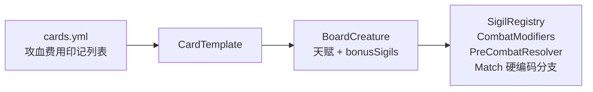

# MC 生物印记体系 · 分析与执行方案

> **状态**：Phase 1–5 主体已落地；Phase 6 平衡与 `tribe` 标签为持续项  
> **卡牌数据**：[mob-cards-catalog.md](mob-cards-catalog.md) · [mob-cards.yml.example](mob-cards.yml.example)  
> **已删除**：`chapter1-sigils-plan.md`（邪恶冥刻第一章 35 印记）、`mob-sigil-redesign.md`（过渡讨论稿）

---

## 一、体系转向（旧 → 新）

| 维度 | 旧体系（已废弃文档） | 新体系（定稿） |
|------|----------------------|----------------|
| 卡牌主体 | ~10 个 `CardId` + 兔/蜂/蚁等剧情卡 | **~83 种 MC 生物**，`cards.yml` 自定义 id |
| 印记来源 | 复刻 Inscryption 第一章 35 项 | **生物习性驱动**，中文【印记名】+ 你的效果文案 |
| 绑定方式 | 少数卡硬编码（蜜蜂=空袭） | **每张生物卡 0~3 个天赋印记**，数据在 yml |
| 设计目标 | 还原 LM 第一章 | **MC 风味 + 套牌配合**（骑乘线、水族线、灾厄线等） |
| 费用默认 | 分散 | **统一 1 腐肉**，进游戏再调 |

**代码现状**：`SigilId` 仍是旧枚举（37 项），`SigilRegistry` 只注册了其中一部分；战斗层 `CombatModifiers` 硬编码了空袭/水袭/死神等。**开工 = 枚举换血 + Handler 重写 + 战斗层对齐新印记，而不是在旧文档上打补丁。**

---

## 二、新印记体系结构分析

### 2.1 三层模型（保持不变，语义换新）



| 层 | 职责 |
|----|------|
| **数据** | `mob_*` 卡：`power`/`health`/`cost`/`sigils[]` |
| **天赋印记** | 生物自带，`sigils` 写入模板，设计器可只读展示 |
| **附加印记** | 商人「印制」、`bonusSigils`（若保留）；与天赋叠加时走 `SigilRules.normalize` |

**原则**：不在 `CardRegistry` / `CardId` 里写死新生物；**Token**（鱼干、小史莱姆、恼鬼）单独 id，`FREE` 或召唤生成。

### 2.2 按触发时机分类（实现时要用的 `SigilTrigger`）

新体系约 **40 种印记**（含变体），按实现管道分组：

#### A. 战斗规则层（`CombatModifiers` / `CombatTargeting` / `CombatResolver`）

不走 `SigilRegistry.fire`，战斗前/命中时查询印记集合。

| 印记 | 枚举 | 要点 |
|------|------|------|
| 空袭 | `AIR_STRIKE` | 越过空列直击；与【高跳】【声呐】交互 |
| 水袭 | `WATER_STRIKE` | 对方回合潜水；持牌人被直击 |
| 高跳 | `HIGH_JUMP` | 本列拦截空袭 |
| 兵分两路 | `SPLIT_STRIKE` | 左右列各一击 |
| 兵分三路 | `TRI_STRIKE` | 左中右三击 |
| 全向攻击 | `ALL_STRIKE` | 对面每列 |
| 射线 | `BEAM` | 指定列远程（守卫者：可选目标） |
| 追击 | `DOUBLE_STRIKE` | 同目标攻击两次 |
| 剧毒 | `VENOM_KILL` | 造成伤害后秒杀（需免疫表：坚壳、护盾） |
| 震慑 | `INTIMIDATE` | 无法被选为攻击目标 |
| 声呐 | `SONAR` | 可攻击带水袭的单位；监守者特化 |
| 坚壳 | `HARD_SHELL` | 单次受伤 ≤1 |
| 尖刺铠甲 | `SPIKY_ARMOR` | 被攻击反击 1 |
| 护盾 | `FIRST_SHIELD` | 首次受伤无效 |
| 臭臭（相邻） | `STINKY` | 熊猫：相邻敌 -1 攻 |
| 臭臭（对面） | `STINKY_FAR` | 猪：对面 -1 攻（建议拆分枚举） |
| 蛛网 | `WEB_WEAK` | 受伤者 -1 力 |
| 迟缓 | `SLOW` | 流浪者：受伤者 -1 力（可与蛛网合并逻辑） |
| 炽热 | `SCORCH` | 标签 + 数值联动（尸壳/热带鱼/焦骸/烈焰人） |
| 哈气 | `HISS` | 对面【自爆】失效 |

#### B. 战前挡刀（`PreCombatResolver`）

| 印记 | 枚举 | 要点 |
|------|------|------|
| 守卫者 | `GUARD_DOG` | 铁傀儡：将移动到将遭攻击的空位 |
| 悦灵 | 同上或 `ALLAY_GUARD` | 与铁傀儡共用 Handler，动画可区分 |

#### C. 注册表事件（`SigilRegistry` + `SigilTrigger`）

| 触发 | 印记示例 |
|------|----------|
| `ON_PLAY` | 唤魔、、游荡（部分） |
| `ON_DEATH` | 骨皇、不死之虫、自爆、分裂 |
| `ON_ATTACKED` | 墨水、穿梭、墨囊类 |
| `ON_SACRIFICE` | 优质祭品、恶魔、鱼饵、生生不息 |
| `ON_TURN_END` | 繁殖、交易、发酵、储水、折磨、稚雏、嗅探 |
| `ON_TURN_START` | 游荡（可选）、交易/发酵计数 |
| `ON_DRAW` / 入手 | 意外 |
| `ON_COMBAT_ATTACK` 后 | 盗物、蓄风 |

#### D. 位移（`BoardShift` 扩展）

| 印记 | 枚举 |
|------|------|
| 穿梭 | `ENDER_SHIFT` |
| 游荡 | `WANDER` |
| 蛮力 | `RUSH_PUSH` |
| 蓄风 | `GUST_SHIFT` |

#### E. 光环 / 全场（遍历场面）

| 印记 | 枚举 |
|------|------|
| 骑乘 | `RIDING`（相邻 +1 力） |
| 嘲讽 | `TAUNT_AURA`（全场 +1 力，注意与「震慑」区分文案） |
| 盗物/骨币 | 攻击时触发，非光环 |

#### F. 进化 / 替换（专用 Handler，需卡 metadata）

| 印记 | 枚举 | metadata |
|------|------|----------|
| 稚雏 | `FLEDGLING` | `evolvesTo: mob_frog` / `mob_wolf` |
| 折磨 | `AFFLICTION` | `evolvesTo: mob_zombified_piglin` 等 |

**说明**：同一 `FLEDGLING` 不能再用全局「变巨狼」逻辑，必须 **按 templateId 读 evolvesTo**。

#### G. 生成物（Token）

| 印记 | 产出 |
|------|------|
| 唤魔 | `mob_vex` ×2 |
| 分裂 | `mob_*_small` ×2 |
| 鱼饵 | `mob_fish_dried` ×1 |

---

### 2.3 旧枚举中**不再保留**的项（新体系未使用）

以下出现在旧 `SigilId` / 旧文档，**你的定稿卡表未引用**，执行时 **删除或标记 deprecated**，避免设计器误选：

`RABBIT_HOLE`, `BEE_STING`, `COPY_ON_PLAY`, `DAM_BUILDER`, `BELL_RINGER`, `ANT_QUEEN`, `ICY_ENTOMB`, `STEEL_TRAP`, `ROCK_BODY`, `TOUCH_OF_DEATH`, `PREVENT_ATTACK`, `LEADER_POWER`, `WHACK_A_MOLE`, `TAIL_ON_HIT`, `TUTOR`, `CORPSE_EATER`, `ORBIT`, `RANDOM_SIGIL`, `ITEM_VENDOR`, `RUSH_LEFT`, `RUSH_RIGHT`

> 若实现「嗅探偷印记」，不再需要 `RANDOM_SIGIL` 随机贴印。

### 2.4 旧枚举中**保留并改文案**的项

`AIR_STRIKE`, `WATER_STRIKE`, `HIGH_JUMP`, `SPLIT_STRIKE`, `TRI_STRIKE`, `ALL_STRIKE`, `STINKY`, `SPIKY_ARMOR`, `BONE_ROYALTY`, `COPY_ON_DEATH`, `BREEDING`, `FLEDGLING`, `QUALITY_SACRIFICE`, `ETERNAL_LIFE`, `GUARD_DOG`, `RUSH_PUSH`

### 2.5 必须**新增**的枚举（约 25 个）

`RIDING`, `WANDER`, `SCORCH`, `FISH_BAIT`, `SURPRISE_ENTRY`, `STINKY_FAR`, `FERMENT`, `TRADE`, `AFFLICTION`, `BEAM`, `VENOM_KILL`, `INK`, `INTIMIDATE`, `STEAL_BONE`, `DOUBLE_STRIKE`, `WATER_STORE`, `TAUNT_AURA`, `FIRST_SHIELD`, `SELF_DESTRUCT`, `WEB_WEAK`, `SLOW`, `GUST_SHIFT`, `SPLIT_SPAWN`, `SONAR`, `DEMON_OFFER`, `HARD_SHELL`, `EVOKE_VEX`, `ENDER_SHIFT`, `SNIFF_STEAL`, `HISS`

（名称可在开工前最终冻结，与 `SigilNames` 中文表一致。）

### 2.6 卡牌与印记数量统计

| 类型 | 数量 |
|------|------|
| 主卡（`mob_*`） | 83 |
| 无印记纯面板 | 约 12（牛、兔、狼、僵尸、卫道士、猪灵蛮兵等） |
| 单印记 | 约 45 |
| 双印记 | 约 22 |
| 三印记 | 1（美西螈） |
| Token | 鱼干、小史莱姆、小岩浆怪、恼鬼 |

**平衡注意**：Boss 面板极高（卫道士 5/1、监守者 3/5）仍标 1 腐肉 — 你明确说进游戏再调，执行阶段 **不改费用**，只接机制。

### 2.7 关键交互（实现时必须单测）

1. **空袭 ↔ 高跳 ↔ 声呐 ↔ 水袭**：海豚/青蛙/监守者/鲑鱼矩阵。  
2. **坚壳 ↔ 剧毒 ↔ 自爆 10 伤**：单次伤害 cap 与即死优先级。  
3. **臭臭两种范围**：相邻 vs 对面全场 debuff。  
4. **折磨 / 稚雏**：同格进化还是先进化再触发回合末。  
5. **铁傀儡 vs 悦灵【守卫者】**：挡刀位移冲突时优先级。  
6. **豹猫【哈气】vs 苦力怕【自爆】**：印记失效是禁用死亡效果还是整个卡。  
7. **嗅探**：偷来的印记是否占 3 印上限、能否偷 `SELF_DESTRUCT`。  
8. **雪傀儡【嘲讽】**：「全场 +1 力」包括敌方，文案是增益还是描述错误（实现前需你确认一句）。

---

## 三、与现有代码的差距（Gap Analysis）

| 模块 | 现状 | 目标 |
|------|------|------|
| `SigilId` | 37 项旧名 | ~45 项新名，删 unused |
| `SigilNames` / `SigilDescriptions` | 旧中文+LM 描述 | 全部换成 [mob-cards-catalog](mob-cards-catalog.md) 文案 |
| `SigilRegistry` | ~15 个 Handler，绑定 `CardId.BEE` 等 | 泛化；去掉对内置 `CardId` 的硬编码 |
| `OnPlayEffects` | 兔穴/蚁后/堤坝 | **删除或清空**，改由 yml 卡 + 新印记 |
| `CombatModifiers` | 部分印记 | 补全射线、坚壳、震慑、剧毒免疫 |
| `PreCombatResolver` | 钻地龙/守护者/断尾 | 只保留【守卫者】语义，删钻地龙/断尾 |
| `CardRegistry` / 默认牌组 | 内置 10 卡 | 默认牌组改为读 `mob-cards.yml` 子集 |
| `CardDesignerSigilMenu` | 列出旧 `IMPLEMENTED` | 列出新全集；天赋印记得灰 |
| `TraderImprintMenu` | 任意旧印 | 仅允许「可印制」子集（若仍需要） |
| `RandomSigilPool` | 存在 | **删除**或停用 |
| `FledglingGrowth` | 狼崽→狼 |  generalized `evolvesTo` |
| `CorpseEaterHandler` | 存在 | 新体系无食尸鬼 → **删除** |
| `BreedingTracker` | 繁殖回合末 | 保留，对接【繁殖】 |
| `cards.yml` | 可能为空 | 导入 `mob-cards.yml.example` |

---

## 四、执行方案（分阶段 · 你确认后执行）

### Phase 0 — 冻结与清理（0.5～1 天）

- [x] 幻翼 2/1+空袭、雪傀儡全场+1、嗅探偷印、流浪商人随机印制（已定稿）  
- [x] `SigilId` 新枚举列表（§2.3～2.5）  
- [x] 删除旧文档  
- [x] README 指向 `mob-cards-catalog.md` + 本文档

### Phase 1 — 数据层（1～2 天） ✅

1. 默认 `cards.yml` 首次释放。  
2. `CardCatalog` 加载 + 设计器 `deckBuilderPool()`。  
3. `evolvesTo` 字段。  
4. `CardRegistry` / `CardId` 标记 `@Deprecated`；默认牌组 `mob_*`。  
5. 旧 `CardId` 保留兼容。

**验收**：`/isc` 设计器能看到 83 张生物；改攻血保存后重启仍在。

### Phase 2 — 枚举与文案（1 天） ✅

1. `SigilId` / `SigilNames` / `SigilDescriptions` 已换血。  
2. 设计器列全集，未接逻辑灰显。  
3. `cards.yml` 主卡印记已填（`scripts/fill_card_sigils.py`）。  
4. 已删 `RandomSigilPool`、`OnPlayEffects`、`CorpseEaterHandler` 等。

**验收**：yml 里写 `AIR_STRIKE` 不会加载失败；设计器显示正确中文。

### Phase 3 — 战斗管道（3～5 天）

按风险排序实现 **CombatModifiers + PreCombatResolver**：

| 批次 | 印记 |
|------|------|
| P3a | `AIR_STRIKE`, `HIGH_JUMP`, `WATER_STRIKE`, `SONAR` |
| P3b | `SPLIT_STRIKE`, `TRI_STRIKE`, `ALL_STRIKE`, `BEAM`, `DOUBLE_STRIKE` |
| P3c | `HARD_SHELL`, `FIRST_SHIELD`, `VENOM_KILL`, `SPIKY_ARMOR`, `INTIMIDATE` |
| P3d | `STINKY`, `STINKY_FAR`, `WEB_WEAK`, `SLOW`, `HISS` |

**验收**：选 6 张代表卡（蝙蝠、青蛙、鲑鱼、监守者、海龟、洞穴蜘蛛）人工打一局。

### Phase 4 — 事件 Registry（4～6 天）

| 批次 | 印记 |
|------|------|
| P4a | `BONE_ROYALTY`, `COPY_ON_DEATH`, `SELF_DESTRUCT`, `SPLIT_SPAWN`, `EVOKE_VEX` |
| P4b | `BREEDING`, `FERMENT`, `TRADE`, `WATER_STORE`, `FISH_BAIT`, `QUALITY_SACRIFICE`, `DEMON_OFFER`, `ETERNAL_LIFE` |
| P4c | `FLEDGLING`, `AFFLICTION`, `INK`, `ENDER_SHIFT`, `GUST_SHIFT`, `WANDER`, `RUSH_PUSH` |
| P4d | `RIDING`, `TAUNT_AURA`, `STEAL_BONE`, `SURPRISE_ENTRY`, `SNIFF_STEAL` |

扩展 `SigilTrigger`：`ON_DRAW`、`ON_TURN_START`（若还没有）。

**验收**：进化链、唤魔分裂、苦力怕自爆、羊发酵/村民交易各测一次。

### Phase 5 — 整合与剔除旧逻辑（2～3 天） ✅ 主体

1. 旧 `OnPlayEffects` 等已删除。  
2. 蜂/狼等改 yml 天赋印。  
3. `EvolutionResolver` 统一稚雏/折磨。  
4. 商店刷新池 `MobShopDefaults` + 敌人 AI `mob_*`。  
5. 印记列表见 `SigilDescriptions` / catalog §3。

**验收**：无 `CardId.RABBIT` 依赖也能完成一整局 PvE。

### Phase 6 — 平衡与内容（持续，你跟调）

- 游戏内改费用/攻血，回写 `cards.yml`。  
- 幻翼、骆驼尸壳等补缺。  
- 印制印记（bonus）是否保留、能印哪些 — 你决定后加白名单。

---

## 五、推荐开工顺序（「全力开工」第一周）

```text
Day 1   Phase 0 + Phase 1（cards.yml 全员可见）
Day 2   Phase 2（枚举换血 + 填 yml 已实现印）
Day 3-4 Phase 3a～3c（战斗核心）
Day 5-7 Phase 4a～4b（死亡/回合末/献祭）
Week 2  Phase 4c～4d + Phase 5
```

**并行规则**：一人改 `CombatModifiers` 时，另一人只加 `SigilRegistry`，避免 merge 冲突 — 文件边界已在上表分开。

---

## 六、你需要确认后我们才能动的 5 件事

| # | 问题 | 建议默认 |
|---|------|----------|
| 1 | 是否**完全取消**流浪商人「印制任意印记」，只保留生物天赋？ | 保留印制，但白名单不含 `SELF_DESTRUCT` / `VENOM_KILL` |
| 2 | 雪傀儡【嘲讽】是「己方全场 +1」还是「敌方全场 +1」？ | 需你一句定稿 |
| 3 | 幻翼 | 暂用 `2/1` +【空袭】+【失眠】？ |
| 4 | 旧内置 10 卡何时从默认牌组移除？ | Phase 5 结束时 |
| 5 | 第一版是否要「嗅探偷印」？ | 可放到 P4d 最后（复杂度高） |

---

## 七、你回复「可以」之后的第一条指令

我们将按顺序执行：

1. **Phase 0**：改 README 引用（已完成删旧 doc）  
2. **Phase 1**：默认 `cards.yml` + `evolvesTo` 字段 + 设计器可读全部 `mob_*`  

不在你确认前 **不修改** `SigilId.java` / `SigilRegistry.java`（避免半新半旧）。

---

## 相关文件

| 文件 | 作用 |
|------|------|
| [mob-cards-catalog.md](mob-cards-catalog.md) | 卡表与印记对照（策划源） |
| [mob-cards.yml.example](mob-cards.yml.example) | 机器可读卡数据 |
| 本文档 | 分析与执行路线图 |
